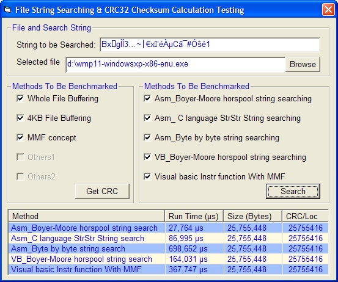



## Fast String Searching &amp; CRC checksum

### Description

Fast String Searching &amp; CRC checksum calculation in Visual Basic using pre compiled assembly code and memory mapped file concepts.This code is tested for binary comparison with ANSI code inputs only. UNICODE character input and strings having ligatures are not tested. It is up to the user to test the code with UNICODE/special character input and validate it. This is my first submission to PSC web site and I welcome your feedback and votes.
 
### More Info
 
FileName with path &amp; search String

It is assumed that the operating system is supporting virtual memory, paging concepts used for memory mapped files.

CRC32 Check sum value &amp; first occurance position of the string pattern found in the file.

The program shall be closed by clicking close button given in the form otherwise the VB IDE will crash as the program uses the string mapping concepts adopted by Chris Lucas

             |
---                |---
**Submitted On**   |2008-11-04 20:15:40
**By**             |[D\.Senthilathiban](https://github.com/Planet-Source-Code/PSCIndex/blob/master/ByAuthor/d-senthilathiban.md)
**Level**          |Advanced
**User Rating**    |4.8 (24 globes from 5 users)
**Compatibility**  |VB 6\.0
**Category**       |[String Manipulation](https://github.com/Planet-Source-Code/PSCIndex/blob/master/ByCategory/string-manipulation__1-5.md)
**World**          |[Visual Basic](https://github.com/Planet-Source-Code/PSCIndex/blob/master/ByWorld/visual-basic.md)
**Archive File**   |[Fast\_Strin2133581192008\.zip](https://github.com/Planet-Source-Code/d-senthilathiban-fast-string-searching-amp-crc-checksum__1-71373/archive/master.zip)

